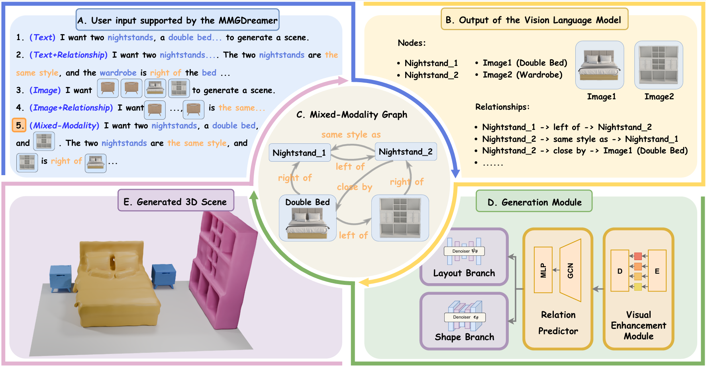

<div align="center">
<h1>MMGDreamer: Mixed-Modality Graph for Geometry-Controllable 3D Indoor Scene Generation</h1>
</div>
<br>
<div align="center">
  <span class="author-block">
                <a href="https://yangzhifeio.github.io/project/MMGDreamer/" target="_blank">Zhifei
                  Yang</a><sup>1</sup>,</span>
              <span class="author-block">
                <a href="https://yangzhifeio.github.io/project/MMGDreamer/" target="_blank">Keyang
                  Lu</a><sup>2</sup>,</span>
              <span class="author-block">
                <a href="https://yangzhifeio.github.io/project/MMGDreamer/" target="_blank">Chao Zhang</a><sup>3✉</sup>,
              </span>
              <span class="author-block">
                <a href="https://scholar.google.com/citations?user=-sLEDGMAAAAJ&hl=zh-CN&oi=ao" target="_blank">Jiaxing
                  Qi</a><sup>2</sup>,
              </span>
              <span class="author-block">
                <a href="https://hq0709.github.io/" target="_blank">Hanqi Jiang</a><sup>3</sup>,
              </span>
              <span class="author-block">
                <a href="https://yangzhifeio.github.io/project/MMGDreamer/" target="_blank">Ruifei Ma</a><sup>3</sup>,
              </span>
              <span class="author-block">
                <a href="https://scholar.google.com/citations?hl=zh-CN&user=BdT5CzcAAAAJ&view_op=list_works&sortby=pubdate"
                  target="_blank">Shenglin Yin</a><sup>1</sup>,
              </span>
              <span class="author-block">
                <a href="https://yangzhifeio.github.io/project/MMGDreamer/" target="_blank">Yifan Xu</a><sup>2</sup>,
              </span>
              <br>
              <span class="author-block">
                <a href="https://scholar.google.com/citations?hl=zh-CN&user=mDVUFvcAAAAJ&view_op=list_works&sortby=pubdate"
                  target="_blank">Mingzhe Xing</a><sup>1</sup>,
              </span>
              <span class="author-block">
                <a href="http://zhenxiao.com/" target="_blank">Zhen Xiao</a><sup>1✉</sup>,
              </span>
              <span class="author-block">
                <a href="https://scholar.google.com/citations?user=KW7wwngAAAAJ&hl=zh-CN&oi=ao" target="_blank">Jieyi
                  Long</a><sup>4</sup>,
              </span>
              <span class="author-block">
                <a href="https://yangzhifeio.github.io/project/MMGDreamer/" target="_blank">Xiangde Liu</a><sup>3</sup>,
              </span>
              <span class="author-block">
                <a href="https://ymxlzgy.com/" target="_blank">Guangyao Zhai</a><sup>5</sup>
              </span>
</div>
<br>
<div align="center">
  <span class="author-block"><sup>1</sup>Peking University &nbsp;&nbsp; <sup>2</sup>Beihang University &nbsp;&nbsp;
  <sup>3</sup> Beijing Digital Native Digital City Research Center &nbsp;&nbsp; <br>
  <sup>4</sup>
  
  <a href="https://www.thetatoken.org/" target="_blank">Theta Labs, Inc.</a> &nbsp;&nbsp
  <sup>5</sup> Technical University of Munich
  <br><b>AAAI 2025</b></span>
<span class="eql-cntrb"><br><sup>✉</sup>Indicates Corresponding Author</span>
</div>

<br>
<div align="center">
<h3>
<a></a>  
  <a href="xxx" target="_blank"> 
      </a> 
      <a href="https://yangzhifeio.github.io/project/MMGDreamer/" target="_blank">
      </a>
</h3>
</div>

  <div align="center">
    <a href="http://zhenxiao.com/team/" target="_blank">
      </a>
      &nbsp; &nbsp; &nbsp; &nbsp; 
  <a href="https://www.thetaedgecloud.com/" target="_blank">
   
  </a>
  </div>
  
<br>
<div align="center">
  
</div>
MMGDreamer is a dual-branch diffusion model for scene generation that incorporates a novel Mixed-Modality Graph, visual enhancement module, and relation predictor. 
<br>
Feel free to contact <a href="https://github.com/yangzhifeio">Zhifei Yang</a> (email at <a href="mailto:yangzhifei@stu.pku.edu.cn">yangzhifei@stu.pku.edu.cn</a>) or open an issue if you have any questions or suggestions.

## 📢 News
- **2024-12-22**: The source code are released. 🎉🎉
- **2024-12-10**: MMGDreamer is accepted by AAAI 2025.👏👏


## 📋 TODO
- [x] Release the training and evaluation model code
- [x] Release the pre-trained weights of VQ-VAE
- [x] Release the training scripts
- [x] Release the evaluation scripts
- [ ] Release the VEM and RP modules code


## 🔧 Installation

```javascript
conda create -n mmgdreamer python=3.8
conda activate mmgdreamer
```
We have tested it on Ubuntu 20.04 with PyTorch 1.11.0, CUDA 11.3 and Pytorch3D.

```javascript
pip install -r requirements.txt 
pip install einops omegaconf tensorboardx open3d
```
(Note: if one encounters a problem with PyYAML, please refer to [this link](https://stackoverflow.com/questions/49911550/how-to-upgrade-disutils-package-pyyaml).)

Install mmcv-det3d (optional):

```javascript
pip install openmim
mim install mmengine
mim install mmcv
mim install mmdet
mim install mmdet3d
```

Install CLIP:

```javascript
pip install ftfy regex tqdm
pip install git+https://github.com/openai/CLIP.git
```
## 📊 Dataset

I. Download [3D-FUTURE-SDF](https://www.campar.in.tum.de/public_datasets/2023_commonscenes_zhai/3D-FUTURE-SDF.zip). This is processed by ourselves on the 3D-FUTURE meshes using tools in [SDFusion](https://github.com/yccyenchicheng/SDFusion).

II. Follow [this page](https://sites.google.com/view/commonscenes/dataset) for downloading SG-FRONT dataset and accessing more information.

III. Optional
1. Download the <a href="https://tianchi.aliyun.com/specials/promotion/alibaba-3d-scene-dataset">3D-FRONT dataset</a> from their official site.

2. Preprocess the dataset following  <a href="https://github.com/nv-tlabs/ATISS#data-preprocessing">ATISS</a>.

IV. Create a folder named `FRONT`, and copy all files to it.

The structure should be similar like this:
```
FRONT
|--3D-FUTURE-SDF
|--All SG-FRONT files (.json and .txt)
|--3D-FRONT (optional)
|--3D-FRONT-texture (optional)
|--3D-FUTURE-model (optional)
|--3D-FUTURE-scene (optional)
|--3D-FRONT_preprocessed (optional, by ATISS)
|--threed_front.pkl (optional, by ATISS)
```
### Models
**Essential:** Download pretrained VQ-VAE model from [here](https://www.campar.in.tum.de/public_datasets/2023_commonscenes_zhai/vqvae_threedfront_best.pth) to the folder `checkpoint`. Thanks <a href="https://ymxlzgy.com/" target="_blank">Guangyao Zhai</a> for provided the pretrained weights.

## 🛩 Training

To train the models, run:

```
bash scripts_sh/train_all_mask.sh
```
`--exp`: the path where trained models and logs would like to be stored.

`--room_type`: rooms to train, e.g., 'livingroom', 'diningroom', 'bedroom', and 'all'. We train all rooms together in the implementation.

`--network_type`: the network to be trained. We use `mmgdreamer`

`--with_SDF`: set to `True`.

`--large` : default is `False`, `True` means more concrete categories.

`--with_CLIP`: set to `True`. Encoding using CLIP.

`--with_image`: set to `True`. `True` means node contains image.


## 📈 Evaluation

To evaluate the models run:
```
bash scripts_sh/eval_all_mask.sh
```
`--exp`: where the models are stored. If one wants to load our provided models, the path should be aligned with 

`--gen_shape`: set `True` to make shape branch work.

`--room_type`: rooms to evaluation, e.g., 'livingroom', 'diningroom', 'bedroom', and 'all'. Please use 'all' to evaluate the results.

`--render_type`: set `mmgscene` to make model work.

`--with_image`: set `True` if you want to use image in the node.

`--mask_type`: set `three` for I+R.

### FID/KID
This metric aims to evaluate scene-level fidelity. To evaluate FID/KID, you need to collect ground truth top-down renderings by modifying and running `collect_gt_sdf_images.py`.

Make sure you download all the files and preprocess the 3D-FRONT. The renderings of generated scenes can be obtained via `bash scripts_sh/eval_all_mask.sh`.

After obtaining both ground truth images and generated scenes renderings, run：
```
bash scripts_sh/compute_fid_scores.sh
```
Attention: FID/KID does not include lamp when calculating, make sure gt image and generated scenes renderings do not include lamp.
### MMD/COV/1-NN
This metric aims to evaluate object-level fidelity. To evaluate this, you need to first obtain ground truth object meshes from [here](https://www.campar.in.tum.de/public_datasets/2023_commonscenes_zhai/gt_fov90_h8_obj_meshes.zip) (~5G). Thanks <a href="https://ymxlzgy.com/" target="_blank">Guangyao Zhai</a> for provided the dataset.

Secondly, store per generated object in the generated scenes, which can be done in `bash scripts_sh/eval_all_mask.sh`.
After obtaining object meshes, modify the path in `compute_mmd_cov_1nn.py`, run:
```
bash scripts_sh/mmd_cov_1nn.sh
```
We use CD distance to calculate.

## 😁 Acknowledgements
**Relevant work:** [CommonScenes](https://github.com/ymxlzgy/commonscenes), [EchoScene](https://github.com/ymxlzgy/echoscene).

**Disclaimer:** This is a code repository for ***reference only***; in case of any discrepancies, the paper shall prevail. 

We sincerely thank Echoscene's author [Guangyao Zhai](https://github.com/ymxlzgy/echoscene) for providing the baseline code and helpful discussions.

## 📚 Citation
If you find our work useful in your research, please consider citing it:
	@misc{
	}
